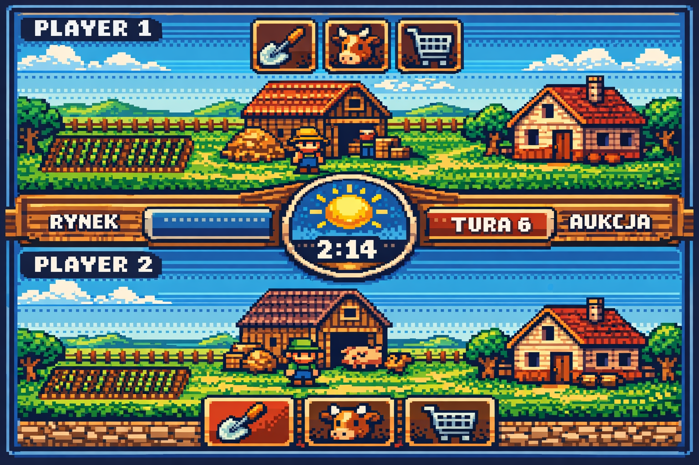
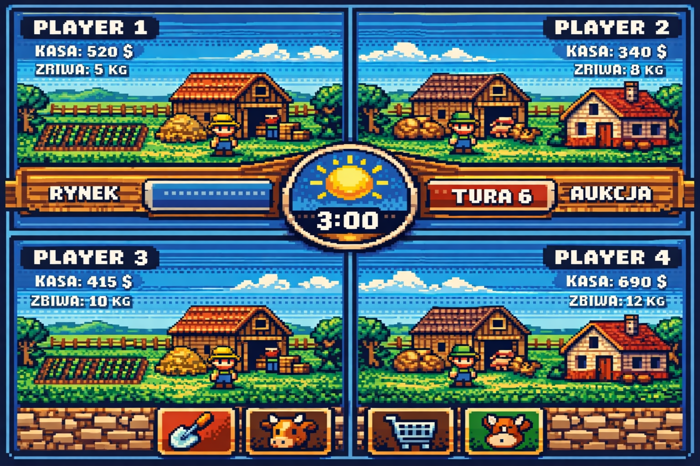

# Rolnik Sofa Arcade — design summary for Codex

Autor idei: użytkownik  
Data pakietu: 2026-03-15

## Co jest w paczce

- `Rolnik_SofaArcade_Design.md` — ten dokument
- `Rolnik_original.prg` — oryginalna gra C64 BASIC jako materiał referencyjny
- `assets/rolnik_mock_2p.png` — pixel-art mock ekranu dla 2 graczy
- `assets/rolnik_mock_4p.png` — pixel-art mock ekranu dla 4 graczy
- `rolnik_design_ssot.md` — główne SSOT designowe dla v1
- `rolnik_market_tenders_and_auctions.md` — rozwinięcie systemu targu, przetargów i aukcji
- `rolnik_implementation_plan.md` — plan wdrożenia pod strukturę repo i milestone'y

## Status dokumentów

Do implementacji jako nadrzędny dokument należy traktować:

- `rolnik_design_ssot.md`

Pozostałe pliki w tym katalogu są materiałem wspierającym i uszczegółowiającym.

## Cel projektu

Stworzyć **kanapową grę ekonomiczno-zręcznościową dla Sofa Arcade**, inspirowaną oryginalnym **Rolnikiem** z C64, ale uproszczoną i przebudowaną tak, żeby:
- działała dobrze dla **2–4 graczy lokalnie**
- miała **czytelny, obrazkowy interfejs**
- łączyła **zarządzanie farmą**, **sezonowe decyzje**, **rynek/aukcje** i **opcjonalne eventy zręcznościowe**
- miała wyraźny rytm: **kwartał → rozliczenie → event → kolejny kwartał**

To nie ma być symulator farmy.  
To ma być **party strategy / couch strategy game** z silnym klimatem farmy i prostym, czytelnym loopem.

---

## Referencja: oryginalny Rolnik

Na podstawie rozpoznanego pliku `Rolnik.prg`:
- gra była turową ekonomią rolną
- 1–4 graczy
- start z gotówką
- kupno/sprzedaż zwierząt i zasobów
- elementy pól, stajni, biura, produkcji i rozliczeń rocznych
- próg wygranej oparty o wartość majątku / gotówki

### Główne motywy, które warto zachować
- prosty i zrozumiały język ekonomii
- mała skala: gospodarstwo, nie imperium
- ryzyko vs bezpieczny dochód
- różne typy aktywności rolnych
- wieloosobowa rywalizacja

### Czego nie kopiować 1:1
- tekstowych, długich menu
- zbyt drobnej księgowości
- zbyt dużej liczby typów towarów
- powolnych, pełnych tur jednego gracza

---

## Wysoki poziom: pitch

**Rolnik Sofa Arcade** to lokalna gra dla 2–4 graczy, w której każdy prowadzi własne gospodarstwo, inwestuje w specjalizację, handluje na wspólnym rynku, bierze udział w sezonowych eventach i walczy o rozwój farmy przez kolejne lata.

### Filary projektu
1. **Sezonowość i planowanie**
2. **Specjalizacja farmy**
3. **Wspólny rynek i aukcje**
4. **Czytelna ekonomia zamiast excela**
5. **Opcjonalne eventy zręcznościowe**
6. **Krótka, gęsta rozgrywka kanapowa**

---

## Layout ekranu

## Mock 2-player

### Założenia układu 2P
- ekran podzielony poziomo:
  - Gracz 1: góra
  - Gracz 2: dół
- przez środek przechodzi **poziomy pasek świata**
- w centrum paska: **okrąg informacyjny**
  - pogoda w kwartale jako obrazek
  - numer kwartału / roku
  - licznik czasu po kliknięciu „koniec tury”
  - licznik w aukcjach / targu / eventach

### Elementy centralnego paska świata
- stan kwartału / roku
- aktualna pogoda
- aktualny event
- komunikaty rynkowe
- timer końca tury
- timer aukcji / przetargu

### Elementy po stronie gracza
- gotówka
- prosty summary farmy
- farmer/chłopek chodzący po własnym gospodarstwie
- budynki widoczne na planszy
- małe zwierzęta chodzące po farmie
- proste, duże ikony akcji lub wejście fizyczne do budynku

## Mock 4-player

### Założenia układu 4P
- podział ekranu na 4 ćwiartki
- w centrum wspólny pasek świata z kołem informacyjnym
- każdy gracz ma swój róg / swoją ćwiartkę farmy
- dla 4P UI musi być jeszcze prostsze:
  - głównie gotówka
  - najważniejszy stan farmy
  - bardzo ograniczona liczba ikon na HUD

### Wniosek projektowy
- **2P** może być bardziej „chodzone” i detaliczne
- **4P** musi być bardziej skrótowe, uproszczone i czytelne z dystansu

---

## Główny model sterowania

### Rdzeń
Gracz steruje **farmerem** po swojej części planszy i **wchodzi do budynków**, żeby wykonywać akcje.

### Budynki minimalne
Opcja uproszczona, preferowana:
- **Pole**
- **Stodoła**
- **Dom**

### Logika budynków
#### Pole
- zasiew
- zmiana przeznaczenia pola
- przegląd stanu uprawy
- decyzje sezonowe

#### Stodoła
- wszystko związane ze zwierzętami
- karmienie pośrednie przez zapasy
- przegląd hodowli i przygotowanie do targu zwierząt
- przegląd stanu hodowli
- magazyn plonów/paszy

#### Dom
- finanse
- rozbudowa
- buy ordery
- podgląd farmy
- potwierdzenie końca tury

### Po wejściu do budynku
Wyświetlane jest **proste menu tekstowe** z krótką listą akcji.  
To jest celowo oldschoolowe i szybkie.

---

## Rytm gry

## Tura = kwartał

To jest preferowane rozwiązanie.

### Cztery kwartały
- **Q1 / Wiosna**
- **Q2 / Lato**
- **Q3 / Jesień**
- **Q4 / Zima**

### Dlaczego kwartał
- miesiąc jest za drobny
- rok jest za wolny
- kwartał daje sensowny rytm decyzji, rozliczeń i eventów

---

## Okna zasiewu

### Siew tylko 2 razy w roku
- **Wiosna** — uprawy jare
- **Jesień** — uprawy ozime

To daje:
- planowanie
- większe znaczenie gleby
- realną zależność hodowli od upraw
- różnicę między kwartałami

### Wniosek UX
Nie zasiewamy co turę.  
W niektórych kwartałach rola pola jest kluczowa, w innych ważniejsze stają się handel, rozbudowa, rynek i eventy.

---

## Typy farm / specjalizacje

Gra ma zachęcać do modelu:

- **jedna główna specjalizacja**
- **jeden dodatek wspierający**

Nie powinno się opłacać robić wszystkiego naraz.

## Specjalizacja 1: mleczna
### Zwierzęta
- krowy

### Produkcja
- mleko (mały, stały dochód kwartalny)

### Wymagania
- łąki / siano
- trochę zboża

### Styl gry
- stabilny
- spokojny
- przewidywalny
- większa rola infrastruktury

### Ryzyko
- wolniejszy start
- większa zależność od przestrzeni i łąk

---

## Specjalizacja 2: świnie / mięsna
### Zwierzęta
- świnie

### Produkcja
- żywiec / mięso jako późniejszy payoff

### Wymagania
- kartofle
- groch jako dodatek

### Styl gry
- bardziej ryzykowny
- długofalowy
- duży payoff przy dobrym planie

### Ryzyko
- koszt paszy
- większa wrażliwość na rynek
- brak natychmiastowego cashflow jak w mleku/jajkach

---

## Specjalizacja 3: drób
### Zwierzęta
- kury

### Produkcja
- jajka (mały, stały dochód kwartalny)
- opcjonalnie później mięso

### Wymagania
- zboże / pasza ziarnista

### Styl gry
- tani start
- szybki zwrot
- elastyczność

### Ryzyko
- niższy pojedynczy payoff
- potencjalna większa podatność na eventy

---

## Relacje upraw ↔ hodowla

### Docelowa zasada
Najlepiej jest mieć:
- 1 uprawę główną
- 1 uprawę wspierającą
w proporcji około:
- **2:1**
- lub **3:1**

### Przykłady
- świnie: **kartofle + groch**
- krowy: **łąki/siano + zboże**
- kury: **zboże + drugi lekki składnik paszy**

### Cel
Gracz powinien patrząc na farmę od razu rozumieć:
„aha, to jest gospodarstwo świńskie”
albo
„to jest farma mleczna”.

---

## Gleba

### Liczba klas gleby
Tylko **3 klasy**:
- słaba
- średnia
- dobra

### Co zmienia gleba
- plon
- opłacalność konkretnych upraw
- strategiczną wartość działki

### Cel
Asymetria i decyzje, ale bez symulacyjnego przesytu.

---

## Infrastruktura

### Budynki
Na start wystarczą:
- stodoła
- dom
- pola
- ewentualnie widoczne zabudowania specjalizacyjne jako upgrade stodoły lub wariant wizualny

Jeżeli potrzebna większa czytelność tematyczna:
- obora
- chlewik
- kurnik
ale można to schować pod jednym wejściem do „stodoły”.

### Zasada rozbudowy
- **1 budynek na turę**
- **1 poziom na turę**

### Cel
Ograniczyć runaway growth i ilość decyzji.

### Efekty rozbudowy
- większa pojemność
- lepsza wydajność
- niższe straty
- unlock dalszych poziomów hodowli

---

## Dochód i rozliczenia

### Dochód kwartalny
- mleko: mały, stały dochód
- jajka: mały, stały dochód

### Dochód długofalowy
- świnie / żywiec: większy, rzadszy payoff

### Dlaczego to działa
Specjalizacje różnią się nie tylko tematyką, ale **rytmem ekonomii**:
- mleko = stabilność
- jaja = szybki lekki obrót
- świnie = inwestycja o opóźnionym zwrocie

---

## Timer tury

### Zasada
Wspólny licznik czasu **nie startuje od razu**.

### Flow
1. Gracze planują bez presji
2. Pierwszy gracz klika **„Koniec tury”**
3. Wspólny timer startuje
4. Pozostali mają np. 15 / 30 / 45 sekund
5. Po czasie następuje rozliczenie

### Konfigurowalne tryby
- Relaxed
- Normal
- Party / panic

---

## Rynek między graczami

## Buy order

Gracz może wystawić zlecenie kupna:
- towar
- ilość
- maksymalna cena

Przykład:
- kartofle x20
- max cena 14

### Ograniczenie
Najlepiej:
- 1 buy order na gracza na kwartał
lub
- koszt wystawienia zlecenia

To zapobiega spamowi.

---

## Logika aukcji / przetargu malejącej ceny

To nie ma być klasyczne „kto pierwszy”.  
Finalna idea z rozmowy:

### Flow
- kupujący ustawia max price
- system pokazuje kolejne ceny malejąco
- przy każdej cenie leci krótki countdown
- jeśli gracz kliknie, **przejmuje prowadzenie**
- jeśli przy kolejnej niższej cenie nikt nie kliknie, wygrywa **ostatni prowadzący**

### Przykład
- 14 — A klika → A prowadzi
- 13 — B klika → B prowadzi
- 12 — A klika → A prowadzi
- 11 — nikt nie klika
- A wygrywa po 12

### Dlaczego to działa
- proste
- szybkie
- emocjonalne
- łączy refleks i kalkulację
- nie wymaga tie-breaków wielu oferentów

### Wniosek
To jest bardziej:
**malejąca cena + przejmowanie prowadzenia**  
niż klasyczna aukcja.

---

## Letni Targ

### Kiedy
Najbardziej naturalnie w **lecie (Q2)**.

### Kto wystawia zlecenia
- AI / rynek lokalny
- handlarze
- młynarze
- mieszkańcy
- kupcy

### Typy zleceń
- 3 losowe buy ordery od AI na plony
- handel materiałami i żywcem po cenach zamrożonych na całą letnią turę

### Co można handlować
- żywiec
- drewno
- kamień
- 3 losowe plony w przetargach końca lata

### Funkcja gameplayowa
- wzrost roli handlu w lecie
- sezonowy szczyt gospodarki
- okazje i niedobory
- mocny event kwartalny
- wybór: pewna sprzedaż żywca teraz albo trzymanie plonów pod przetargi

---

## Eventy kwartalne

## Zasada ogólna
Koniec kwartału powinien mieć **charakter**, ale nie każdy event musi być obowiązkową minigrą.

### Preferowane podejście
- event może być:
  - ekonomiczny
  - zręcznościowy
  - strategiczny
- event zręcznościowy może być **opcjonalny**
- gracz może zapłacić wpisowe i wziąć udział
- można też tylko obstawiać

---

## Event 1: Wyścigi konne
### Rola
- naturalny event farmowy
- daje sens posiadaniu koni
- pozwala obstawiać

### Udział
- wpisowe
- własny koń albo udział systemowy
- opcjonalne obstawianie

### Styl
- prosty joystick killer / left-right / timing
- oldschoolowy vibe
- krótki i widowiskowy

---

## Event 2: Dożynki
### Kierunek
Lekka zręcznościówka lub wyścigopodobna minigra:
- transport
- zbiory na czas
- wyścig wozów
- konkurs dożynkowy

### Rekomendacja
Najbardziej pasuje:
- **wyścig wozów**
lub
- **transport / zbiór na czas**

### Dlaczego
- pasuje do farmy
- łatwo spiąć z assetami i klimatem
- może być krótki i widowiskowy

---

## Event 3: Aukcja ziemi
### Kiedy
Najlepiej na **koniec roku**, nie co kwartał.

### Dlaczego
- daje wagę i prestiż
- zwiększa napięcie
- pozwala na denial play
- daje catch-up i rywalizację

### Obiekty aukcji
- 1–3 działki
- różna jakość gleby
- ewentualne cechy specjalne

---

## Pełny loop roku

## Q1 — Wiosna
- zasiew jarych
- przygotowanie gospodarstwa
- inwestycje
- start hodowli
- buy ordery ad hoc
- koniec kwartału: lżejszy event / rozliczenie

## Q2 — Lato
- zakup materiałów
- sprzedaż zwierząt po cenach zależnych od jakości, zamrożonych na całą turę
- Letni Targ AI: 3 przetargi na losowe plony
- przychody z mleka/jajek
- buy ordery
- opcjonalny event: wyścigi konne

## Q3 — Jesień
- zbiory
- zasiew ozimych
- planowanie zapasów paszy
- opcjonalny event: dożynki

## Q4 — Zima
- utrzymanie
- przegląd farmy
- większe rozliczenie
- aukcja ziemi
- ranking roku

---

## Nowa gra / flow startowy

### Ekran nowej gry
- liczba graczy
- wybór postaci / twarzy farmera
- wpisanie imienia
- długość meczu
- tryb timera

### Założenie
Ma być szybkie.
Nie dłużej niż minuta do wejścia do gry.

### Assety
Można wykorzystać istniejące assety postaci / facjat z **Kielbasa Empire** jako placeholdery albo bazę stylu.

---

## Rekomendacje dla implementacji w SofaArcade

### Co to ma być
To ma być **gra SofaArcade**, nie HTML demo.  
Czyli:
- layout ma być projektowany pod docelowy renderer / scenę gry
- layout z mocków pozostaje referencją split-screen i centralnego world bara, ale `v1` jest menu-driven, bez chodzenia farmerem
- mock służy tylko jako **referencja kompozycji**, nie gotowy layout 1:1

### Priorytet implementacyjny
1. Core economy loop
2. Layout świata + sekcje UI
3. Proste budynki i menu
4. Timer końca tury
5. Buy orders i rynek
6. Letni Targ
7. Eventy
8. Balans specjalizacji

---

## Minimalny scope v1

### Zwierzęta
- krowy
- świnie
- kury

### Uprawy
- kartofle
- groch
- zboże jare
- zboże ozime
- łąka / siano

### Gleba
- słaba / średnia / dobra

### Budynki
- dom
- stodoła
- pole

### Eventy
- Letni Targ
- wyścigi konne
- dożynki (prosta minigra)
- aukcja ziemi roczna

### Tryby graczy
- 2P
- 4P

---

## Pytania projektowe dla Codexa / do dopracowania

1. Czy 4P powinno mieć dokładnie ten sam system chodzenia farmerem co 2P, czy bardziej skrótowy?
2. Czy w 4P część akcji w budynkach nie powinna otwierać się szybciej / bardziej „instant”?
3. Czy mleko i jajka sprzedają się automatycznie po cenie bazowej, czy trafiają do magazynu?
4. Czy rynek powinien mieć dodatkową prowizję / koszt wystawienia orderu?
5. Jakie dokładnie są progi kosztów rozbudowy budynków?
6. Czy koń jest częścią ekonomii farmy czy osobnym, bardziej eventowym zasobem?
7. Jak długo ma trwać pełny mecz:
   - krótki
   - standard
   - długi

---

## Proponowane zadania dla Codexa

## Task 1 — Core design skeleton
- zdefiniować podstawowe data model:
  - Gracz
  - Farma
  - Pole
  - Zwierzę
  - Budynek
  - Uprawa
  - Kwartał
  - Event
  - BuyOrder

## Task 2 — Turn/quarter loop
- zaimplementować flow:
  - start kwartału
  - aktywne decyzje graczy
  - click „koniec tury”
  - start wspólnego timera
  - rozliczenie
  - event końcowy
  - przejście do kolejnego kwartału

## Task 3 — Farming economy
- zasiew jarych i ozimych
- plon zależny od gleby
- produkcja kwartalna mleka/jaj
- wzrost i sprzedaż żywca

## Task 4 — Building interaction
- wejście farmerem do budynku
- otwarcie prostego menu tekstowego
- wykonanie akcji
- zamknięcie menu i powrót na farmę

## Task 5 — Buy order market
- wystawienie zlecenia kupna
- malejąca cena
- przejmowanie prowadzenia
- finalizacja kontraktu

## Task 6 — Summer market
- 3 ordery AI na losowe plony
- zakup materiałów po cenach dynamicznych między latami, ale stałych w turze
- sprzedaż zwierząt po cenach dynamicznych między latami, ale stałych w turze
- szybka sesja targowa
- integracja z ekonomią

## Task 7 — Events
- wyścigi konne
- dożynki / wyścig wozów / zbiór na czas
- aukcja ziemi

## Task 8 — Presentation layer
- layout 2P
- layout 4P
- centralny pasek świata
- koło z pogodą / timerem / numerem kwartału
- summary graczy
- farmer sprite
- chodzące zwierzęta
- widoczne budynki

---

## Finalna, krótka definicja gry

**Rolnik Sofa Arcade** to lokalna gra dla 2–4 graczy, w której każdy prowadzi własne gospodarstwo, wybiera specjalizację, planuje zasiewy dwa razy w roku, rozwija budynki, handluje na żywym rynku, bierze udział w sezonowych eventach i walczy o najlepszą farmę w szybkim, czytelnym, kanapowym formacie.

---

## Krótkie podsumowanie projektowe

### Co jest najważniejsze
- prostota UI
- wyraźny sezonowy rytm
- specjalizacja zamiast „rób wszystko”
- wspólny rynek
- farmer jako fizyczny avatar na farmie
- eventy jako smak, nie dominujący chaos

### Czego pilnować
- nie zamienić gry w księgowość
- nie przegiąć z liczbą upraw i budynków
- nie przesadzić z minigrami
- utrzymać tempo i czytelność dla 2P i 4P

### Najmocniejszy hook
**Stary Rolnik z C64 odrodzony jako kanapowa gra strategiczno-zręcznościowa dla Sofa Arcade.**
