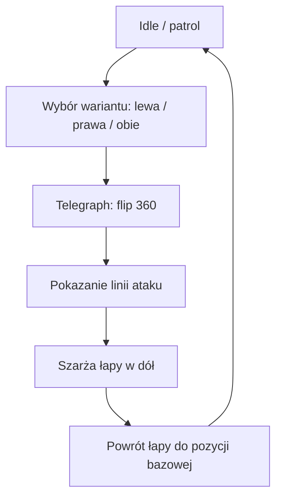
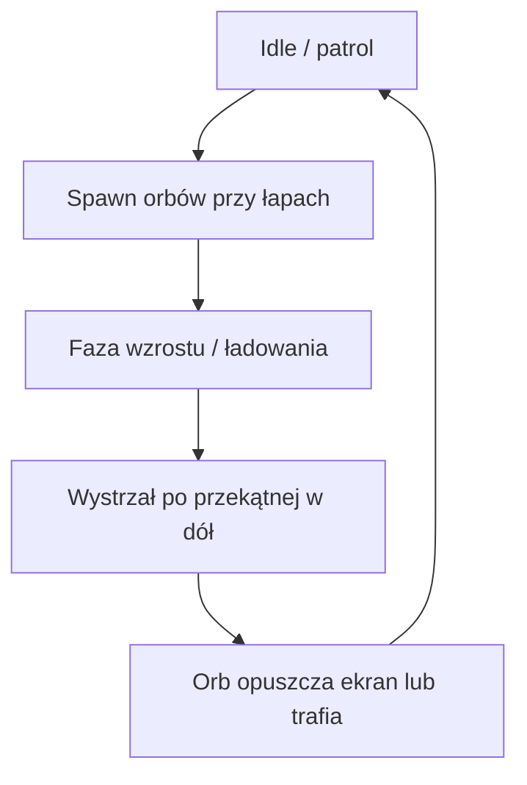
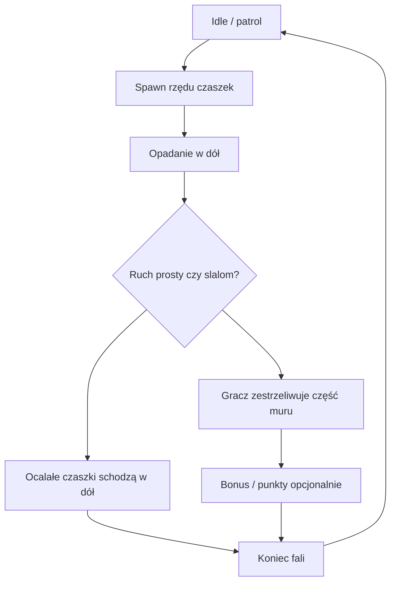
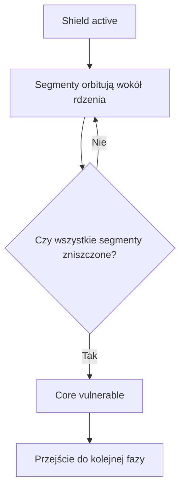
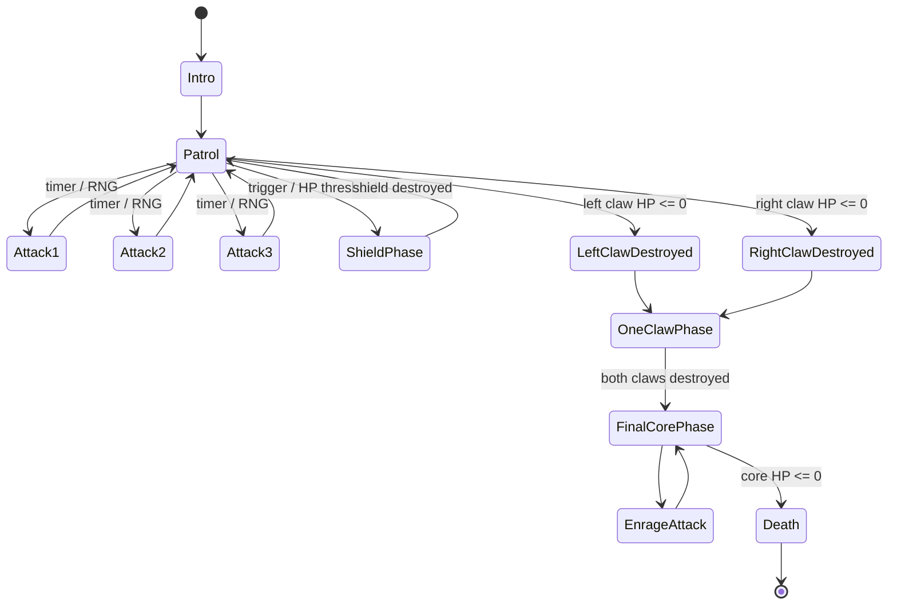

# Pixel Invaders — Boss: dokumentacja ruchu i ataków

> Opracowane na podstawie odręcznych szkiców. W kilku miejscach notatki są częściowo nieczytelne, więc poniżej zaznaczam zarówno odczyt, jak i rozsądne doprecyzowanie do implementacji.

---

## 1. Założenie ogólne

Boss składa się z:
- **rdzenia / głowy** (centralny hitbox bossa),
- **2 łap / skrzydeł / szczypiec** po bokach,
- opcjonalnie **segmentów osłony asteroidowej** krążących wokół rdzenia.

Gracz znajduje się na dole ekranu i porusza się poziomo, z możliwością unikania pionowych i ukośnych zagrożeń.

---

## 2. Odczyt ze szkicu — ruch bazowy

Na szkicu w sekcji **RUCH** widać:
- ruch bossa **prawo / lewo** w górnej części planszy,
- ruch łap **góra / dół** niezależnie od rdzenia,
- dopisek:
  - **„prędkość 2x prędkość łap”** — odczyt najpewniejszy: rdzeń porusza się szybciej niż łapy,
  - **„mały skok”** po jednej stronie,
  - **„większy skok”** po drugiej stronie,
  - **„ruch prawo lewo całość”** — cały boss przesuwa się horyzontalnie.

### Interpretacja implementacyjna

Najbardziej sensowny model:
- **rdzeń** wykonuje ciągły ruch poziomy w zakresie areny,
- **łapy** poruszają się pionowo między pozycją wysoką i niską,
- ruch łap może być niesymetryczny:
  - jedna łapa ma **krótszy skok pionowy**,
  - druga **dłuższy skok pionowy**,
- rdzeń może poruszać się ok. **2x szybciej** niż sama animacja łap, co tworzy wrażenie „pływania” całej konstrukcji.

---

## 3. Model ruchu — wersja techniczna

## 3.1. Strefy pozycji

- **Rdzeń**: górna środkowa część ekranu.
- **Lewa łapa**: lewa górna ćwiartka.
- **Prawa łapa**: prawa górna ćwiartka.
- **Gracz**: dolna część ekranu.

## 3.2. Pętle ruchu

### Rdzeń
- porusza się w osi **X** między lewym i prawym limitem,
- zmiana kierunku po dojściu do limitu,
- prędkość bazowa: `boss_core_speed`.

### Łapy
Każda łapa ma:
- własne `anchor_x`,
- własny zakres pionowy `y_min -> y_max`,
- własną prędkość `claw_speed`,
- opcjonalnie osobny amplitudowy zasięg:
  - lewa: `small_drop_range`,
  - prawa: `big_drop_range`.

### Relacja prędkości
Według szkicu można to zapisać jako:

```text
boss_core_speed ≈ 2 * claw_animation_speed
```

albo odwrotnie — jeśli po testach w grze wyjdzie ciekawiej — ale z notatki wynika raczej, że **rdzeń jest szybszy od łap**.

---

## 4. Atak I — obrót łap o 360° i szarża w dół

### Odczyt ze szkicu
Na szkicu:
- **„ATAK I — przed atakiem łapami flip o 360°”**
- **„po obrocie łapy uderzają w statek gracza”**
- **„musi być czas na zbijanie 2 linii ataku”**
- **„randomowo — prawa / lewa, lub obie naraz”**
- **„podczas ataku łapy są podatne na ataki gracza”**

### Interpretacja gameplayowa
To wygląda na atak „telegraph -> windup -> strike”:

1. Jedna lub obie łapy wykonują **pełny obrót / flip 360°**.
2. Obrót działa jako **czytelny sygnał** nadchodzącego ataku.
3. Po zakończeniu obrotu łapa wykonuje **uderzenie / szarżę w dół**, celując w linię gracza.
4. Wariant ataku wybierany losowo:
   - tylko lewa,
   - tylko prawa,
   - obie jednocześnie.
5. Podczas animacji przygotowania i/lub szarży łapy są **odsłonięte** i można je ostrzeliwać.

### Założenie projektowe „2 linii ataku”
Z dopisku wynika, że gracz powinien mieć czas na reakcję wobec **dwóch torów zagrożenia**. To może oznaczać:
- dwie pionowe kolumny zagrożenia (lewa i prawa), albo
- dwa osobne przebiegi ataku następujące szybko po sobie.

Najrozsądniej wdrożyć to tak:
- każda aktywna łapa wyznacza własną **linię uderzenia**,
- przed realnym trafieniem pojawia się **warning line / marker**,
- gracz ma krótki czas na zjazd w bok.

### Schemat ataku I



### Parametry do implementacji

```text
attack1_flip_duration
attack1_warning_duration
attack1_strike_speed
attack1_recover_duration
attack1_variant_weights = {left, right, both}
attack1_claws_vulnerable = true
```

---

## 5. Atak II — rosnące kule energetyczne

### Odczyt ze szkicu
Na szkicu:
- **„ATAK II — łapy wytwarzają rosnące kule energetyczne”**
- **„nie można ich zestrzelić, tylko unikać”**

### Interpretacja gameplayowa
Każda łapa generuje kulę / orb przy swojej pozycji. Kule:
- pojawiają się przy lewej i/lub prawej łapie,
- **rosną z czasem**,
- po naładowaniu zaczynają lecieć po torze w stronę dolnej części planszy,
- są **niezniszczalne**, więc wymuszają czysty unik.

Możliwe warianty toru:
- prosta przekątna do środka,
- lekki tracking w stronę pozycji gracza z chwili wystrzału,
- odbicie od ściany (bardziej hard mode).

Ze szkicu najbardziej pasuje wersja:
- orb po lewej leci ukośnie w dół ku środkowi,
- orb po prawej analogicznie w dół ku środkowi,
- gracz przeciska się między nimi lub ucieka na bok.

### Schemat ataku II



### Parametry do implementacji

```text
attack2_spawn_count_per_side
attack2_charge_duration
attack2_growth_curve
attack2_projectile_speed
attack2_projectile_homing = false|light
attack2_projectiles_destructible = false
```

---

## 6. Atak III — spadający mur z czaszek

### Odczyt ze szkicu
Na szkicu:
- **„ATAK III — spadający mur z czaszek — do zestrzelenia”**
- dopisek: **„(może za zestrzelenie dać bonusy?)”**
- dodatkowo: **„mogą poruszać się slalomem na boki”**

### Interpretacja gameplayowa
Boss przyzywa poziomy rząd małych wrogów / czaszek. Te obiekty:
- spadają z góry na dół,
- można je **zestrzelić**,
- mogą poruszać się:
  - pionowo,
  - albo lekko **slalomem** w osi X.

To tworzy „kurtynę” zagrożenia pomiędzy bossem a graczem.

### Najlepsza implementacja
- spawn 4–6 czaszek w jednym rzędzie,
- każda ma niewielki offset fazy ruchu bocznego,
- po zniszczeniu może:
  - zniknąć bez efektu,
  - zostawić punkt / pickup / charge,
  - odblokować krótkie okno do ostrzału bossa.

### Schemat ataku III



### Parametry do implementacji

```text
attack3_skull_count
attack3_fall_speed
attack3_slalom_amplitude
attack3_slalom_frequency
attack3_hp_per_skull
attack3_bonus_drop_chance
```

---

## 7. Asteroid Shield — osłona segmentowa

### Odczyt ze szkicu
Na szkicu:
- **„ASTEROID SHIELD — dopóki gracz nie zestrzeli ostatniej z nich — ryt nie będzie podatny na ataki”**
- niżej: **„fajnie by było rozwalać wpierw łapy i tak zostanie sam ryt, co wali jakimś mega mocnym atakiem, ale nie mam wkręta na to pomysłu”**

Słowo „ryt” interpretuję jako rdzeń / boss po zdjęciu elementów zewnętrznych.

### Interpretacja gameplayowa
Boss może wejść w fazę ochronną:
- wokół rdzenia krąży kilka asteroid / segmentów osłony,
- dopóki istnieje choć jeden segment osłony, **rdzeń jest niewrażliwy**,
- gracz musi zniszczyć wszystkie segmenty,
- po ich zdjęciu boss przechodzi do następnej fazy podatności.

### Możliwa struktura faz

#### Faza A — pełny boss
- aktywne łapy,
- opcjonalnie aktywna osłona asteroidowa,
- rdzeń częściowo lub całkowicie niewrażliwy.

#### Faza B — po zniszczeniu łap
- zostaje sam rdzeń,
- rdzeń przechodzi w tryb agresywny,
- dostaje nowy „mega mocny atak”.

To bardzo dobry kierunek, bo daje naturalną dramaturgię walki.

### Schemat osłony



### Parametry do implementacji

```text
shield_segment_count
shield_orbit_radius
shield_orbit_speed
shield_segment_hp
core_invulnerable_while_shield_exists = true
```

---

## 8. Proponowany przebieg walki z bossem

## Faza 1 — wejście i patrol
- Boss pojawia się u góry ekranu.
- Całość wykonuje ruch poziomy prawo-lewo.
- Łapy pracują pionowo, każda z inną amplitudą.
- Co kilka sekund boss losuje jeden z ataków I–III.

## Faza 2 — częściowa destrukcja
- Gracz może niszczyć łapy podczas określonych okien podatności.
- Jeśli aktywna jest osłona asteroidowa, najpierw trzeba zdjąć jej segmenty.
- Po zniszczeniu jednej łapy boss staje się bardziej agresywny.

## Faza 3 — rdzeń solo / enrage
Po zniszczeniu obu łap:
- zostaje sam rdzeń,
- zaczyna wykonywać szybszy ruch poziomy,
- dostaje 1 nowy silny atak końcowy.

---

## 9. Propozycja „mega mocnego ataku” rdzenia po zniszczeniu łap

Ponieważ na szkicu jest sugestia, ale bez konkretu, proponuję jeden z tych wariantów:

### Wariant A — Laser sweep
- rdzeń ładuje promień,
- strzela grubym laserem pionowo w dół,
- następnie omiata ekran lewo-prawo.

### Wariant B — Shockwave burst
- rdzeń ładuje impuls,
- wypuszcza pierścienie energii rozszerzające się promieniście,
- gracz musi przechodzić przez szczeliny.

### Wariant C — Targeted dive marker
- rdzeń oznacza 2–3 strefy na podłodze,
- po chwili uderza w nie sekwencyjnie.

Do Pixel Invaders najlepiej pasuje **Wariant A albo B**.

---

## 10. Pełna maszyna stanów bossa



---

## 11. Hitboxy i podatność

### Rdzeń
- główny hitbox bossa,
- może być:
  - zawsze podatny,
  - podatny tylko po zdjęciu osłony,
  - podatny tylko w wybranych momentach.

### Łapy
- osobne HP dla lewej i prawej,
- w Ataku I wyraźne okno podatności,
- można nimi sterować przebiegiem walki (destrukcja = przejście fazy).

### Czaszki z Ataku III
- małe, zestrzeliwalne cele,
- opcjonalny bonus za szybkie czyszczenie całej fali.

### Kule energetyczne z Ataku II
- niezniszczalne,
- tylko do omijania.

### Segmenty osłony asteroidowej
- zestrzeliwalne,
- po zniszczeniu wszystkich — rdzeń podatny.

---

## 12. Balans i czytelność

Żeby boss był „arcade fair”, warto zadbać o:
- **czytelny telegraph** przed każdym silnym atakiem,
- różne kolory / efekty dla:
  - obrotu łap,
  - ładowania kul energetycznych,
  - spawnów czaszek,
  - aktywnej osłony,
- krótkie, ale wyraźne okna bezpieczeństwa,
- niedopuszczenie do sytuacji, w której Atak II i III nakładają się w sposób nieunikalny.

---

## 13. Minimalna specyfikacja implementacyjna

```yaml
boss_pixel_invaders:
  parts:
    core:
      hp: 100
      horizontal_move: true
      speed: 2.0
    left_claw:
      hp: 35
      vertical_range: small
      vulnerable_windows:
        - attack1_flip
        - attack1_strike
    right_claw:
      hp: 35
      vertical_range: large
      vulnerable_windows:
        - attack1_flip
        - attack1_strike
    asteroid_shield:
      enabled: true
      segments: 6
      core_invulnerable_while_active: true

  attacks:
    attack1:
      name: claw_flip_strike
      variants: [left, right, both]
      telegraph: flip_360
      warning_lines: true
      claws_vulnerable: true

    attack2:
      name: growing_energy_orbs
      destructible: false
      projectile_pattern: diagonal_down

    attack3:
      name: falling_skull_wall
      destructible: true
      movement: vertical_or_slalom
      bonus_on_destroy: optional

  phases:
    - intro
    - patrol
    - shield_phase
    - one_claw_phase
    - final_core_phase
    - death
```

---

## 14. Co było niejednoznaczne na szkicach

Te fragmenty odczytałem z pewnym marginesem błędu:
- dopisek o prędkości: **„prędkość 2x prędkość łap”**,
- dopisek **„mały skok / większy skok”** — interpretowany jako różne amplitudy pionowego ruchu łap,
- słowo **„ryt”** — potraktowane jako rdzeń / boss po zdjęciu osłon i łap.

Jeśli chcesz, mogę teraz zrobić z tego jeszcze jedną z tych wersji:
1. **bardziej techniczny design doc pod Godota / kod**,
2. **ładny diagram faz bossa w SVG / PNG**,
3. **task.md dla Codexa do implementacji tego bossa krok po kroku**.
